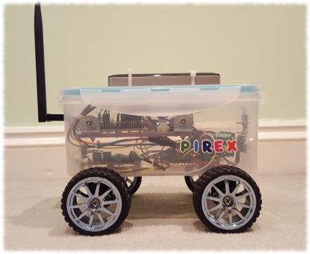
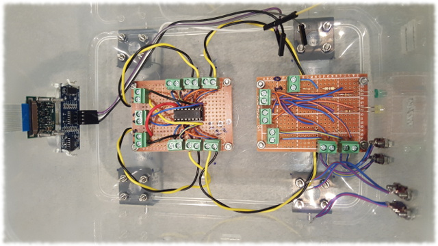
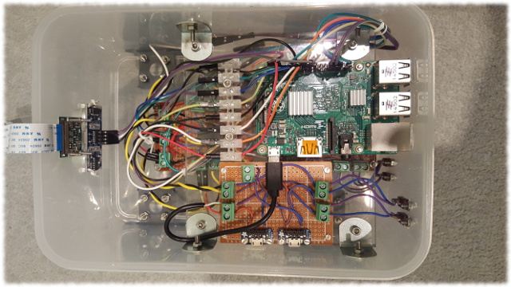

# Reference robot design

The are no strict requirements to the way how PiRex robot is built. Current design is based on Raspberry Pi board and camera module, L293D motor drive and HC-SR04 ultrasonic distance sensor. But how it is all connected and put together is completely customary, nothing is enforced by the provided software. It is assumed that anyone trying to get something similar working, has some basic knowledge of electronics, wiring, etc.

The HC-SR04 ultrasonic distance sensor is optional. If particular design does not assume performing distance measurement, the PiRex code can be configured to cope without it.

The L293D motor drive is a must for now. However, adding support for different motor drive is trivial and not a show-stopper.

The largest part of the PiRex code base is concentrated around interfacing with Raspberry Pi camera module and providing embedded web server, which allows controlling the robot from either a web browser or a dedicated native application. Since Raspberry Pi and its camera module is the core of the design, the provided software can be of use for any other robot sharing these components. Adding support for extra components/sensors is really easy to accomplish provided the current infrastructure and the L293D/HC-SR04 examples.

An example of an assembled PiRex robot may look something like shown below. However, it may look totally different as long as it is built using the supported components.

Apart from L293D motor drive and HC-SR04 ultrasonic distance sensor, the example robot has 2 status LEDs and two switch buttons. One LED indicates when the PiRex software is running, while the second LED indicates if there is an active connection to the robot. The switch buttons currently are not in use, however can be used in the future for some interaction with the robot.

Again, it is completely customary which GPIO pins to use for connecting different components to Raspberry Pi. However, for the reference, here is the pin layout used for the sample robot above. This layout is expected by the PiRex software by default.

**Note**: the table below uses physical pin numbering of Raspberry Pi, not the GPIO logical numbering.

| Pin number | Purpose                                    |
| ---------- | ------------------------------------------ |
| 1          | Power supply for two switch buttons, 3.3V  |
| 2          | HC-SR04 Power supply (VCC), 5V             |
| 4          | L293D chip power supply (VCC1, pin 16), 5V |
| 6          | Ground for LEDs and switch buttons         |
| 7          | Run time status LED (running software)     |
| 9          | L293D ground (pins 4, 5, 12, 13)           |
| 11         | Connectivity status LED                    |
| 12         | Enable left motors (1,2EN, pin 1)          |
| 13         | Signal from switch button 1                |
| 14         | HC-SR04 ground                             |
| 15         | Signal from switch button 2                |
| 16         | Left motors input 1 (pin 2)                |
| 18         | Left motors input 2 (pin 7)                |
| 22         | HC-SR04 trigger                            |
| 29         | Right motors input 1 (pin 15)              |
| 31         | Right motors input 2 (pin 10)              |
| 33         | Enable right motors (3,4EN, pin 9)         |
| 37         | HC-SR04 echo, through voltage divider 	    |

If the reference pin layout is reused and robot has all the same components, then there is nothing to change in the PiRex code. However, if connections are different or LEDs and HC-SR04 ultrasonic distance sensor are missing, then the **BotConfig.h** header file must be edited first before [building the code](Building.md).

## Few more pictures of the sample build

Some more pictures of the sample build are shown below. The first layer of the robot contains two breakout boards – one for the L293D motor drive and the other one for LEDs, switch buttons and a voltage divider for the echo pin of HC-SR04 distance sensor. Both boards have a number of screw terminal blocks, which makes it easer to get connections to Raspberry Pi’s pins and other components.

Putting small electronics components on the breakout boards makes it easier to attach those to the ~~lunch box~~ robot’s body and keeps all the soldering isolated on the boards only.

The second layer of the build holds the Raspberry Pi and another small breakout board used for distributing power supply to the Pi and motors.

For more information one the sample build and the hardware components in use, check the Code Project article describing it.
