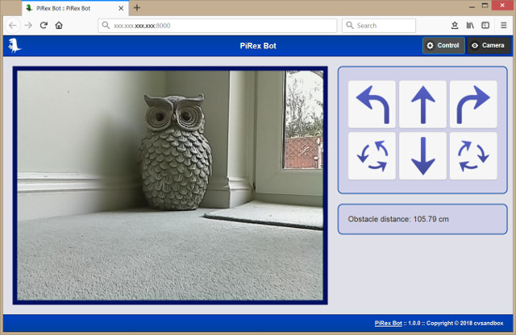
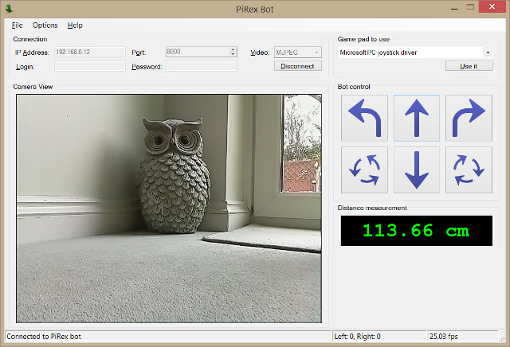

# Running PiRex software

Once the PiRex [code is built](Building.md), it is ready to run so that the robot could be controlled remotely. The application provides only command line interface, which means all configuration settings must done through command line options. The list of available options can be obtained by running the application with the **-?** key. Most of the configuration options are self explanatory and allow changing configuration values like camera's resolution and frame rate, JPEG quality level, HTTP port of the robot's web server, title of the robot, authentication options, etc.

By default, anyone is allowed to control PiRex robot and view its camera. However, it is possible to change that by providing users' file (**-htpass** option), which can be created with the help of [Apache htdigest](https://httpd.apache.org/docs/2.4/programs/htdigest.html) tool. Once users' file is specified, only users listed in that file will be able to view robot's camera and only user with **admin** name will be able to change camera's settings and control robot's motors. However, by using **-viewer** and **-config** options it is possible to control who can do what. For example, setting **-viewer:any** and **-config:user** options, will give view access to anyone, while configuration/control access to registered users only.

Once the application is running, it starts its embedded web server providing access to the robot's camera and control options.

## Web interface

While PiRex application is running, the robot can be controlled from a preferred browser – all default web UI is embedded directly into the binary, so no extra web server or content is required. Simply type robot's IP address:port into a browser and you are ready to go.

The default view simply shows current view from the robot's camera. However, the "Control" tab allows controlling the robot's movement and getting distance measurements, while the "Camera" tab allows changing different camera's settings.

## .NET client application

In addition to the web browser control, it is possible to have a dedicated application for robot manipulation through the exposed [WEB API](WebAPI.md). A sample .NET client application is provided, which demonstrates the use of this API and allows controlling PiRex robot from C# code.

Controlling the robot from a native application may provide extra flexibility and features. For example, the provided .NET client application demonstrates how to control the robot using a game pad device, which may give better agility to the robot's movement. Another example could be using some computer vision SDK and adding some video processing for the robot's camera.
